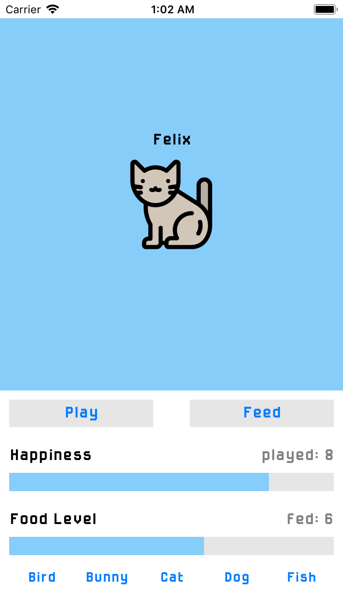
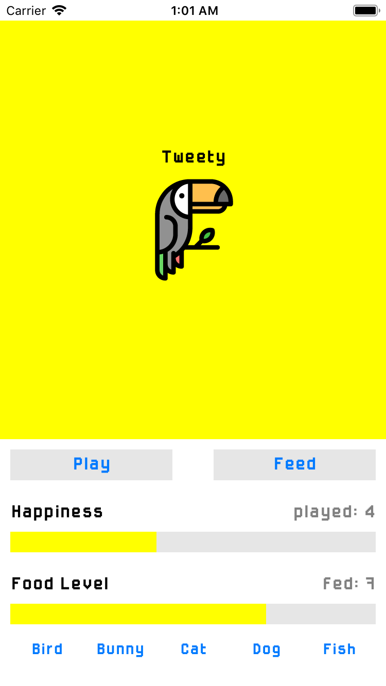
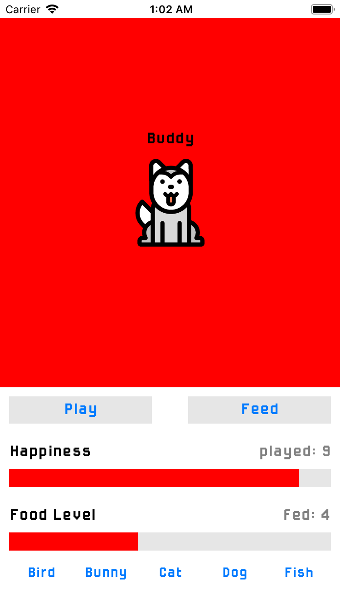
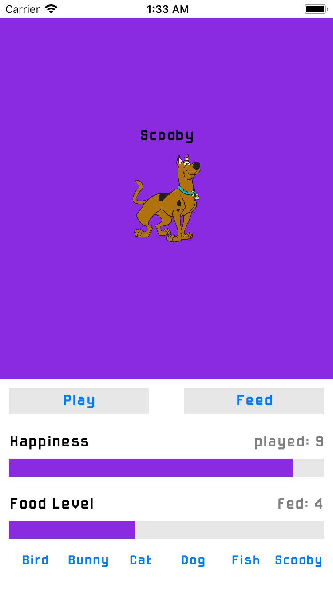

# virtualPetApp

Second lab for CSE 438 Mobile App Development. Simple virtual pet app. This app was made in Xcode, using swift, and was done all programmatically.

This app allows the user to have multiple pets. Each pet can be fed, and as long as it is being fed it can be played with. The purpose of this app was to practice with auto layout. This app works on all devices, and is optimized for either screen orientation.

 

For the creative feature I added a few things to improve the user's experience. The first feature I added was to give the user a warning with vibration when they try to play the pet without feeding it first. Along with this I also added a custom font that gives the game a little bit of a retro feel. In addition to this I also added sounds. If the user feeds or play with the pet in makes a sound effect as well as if you tap the pet image. Finally as a bonus, I added a hidden pet. If you beat the game and max out the happiness levels of all the pets it reveals another mystery pet.

 

